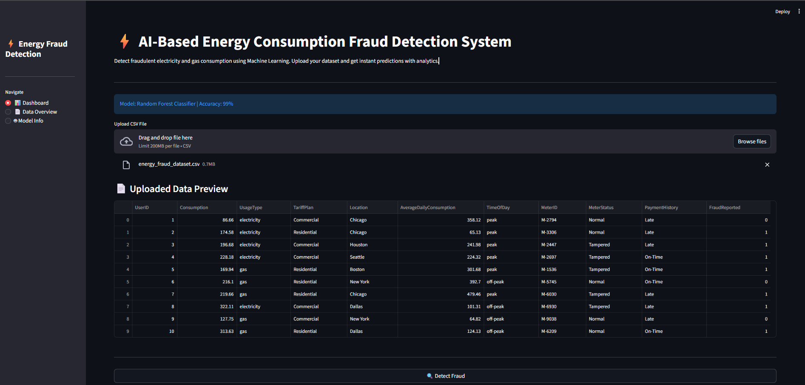
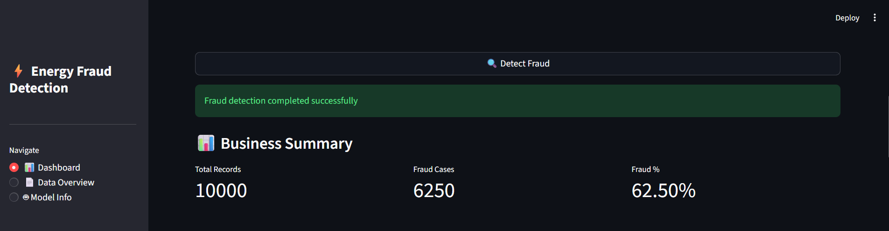
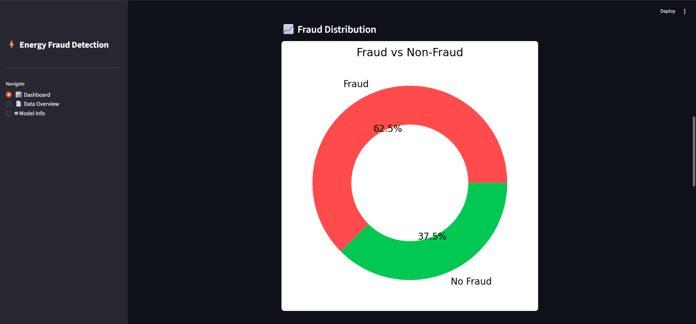
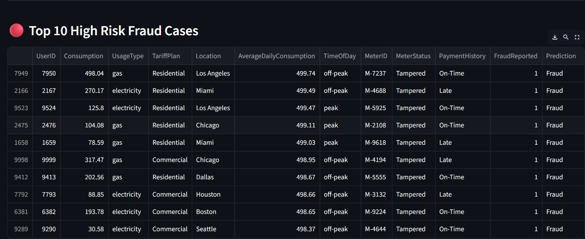
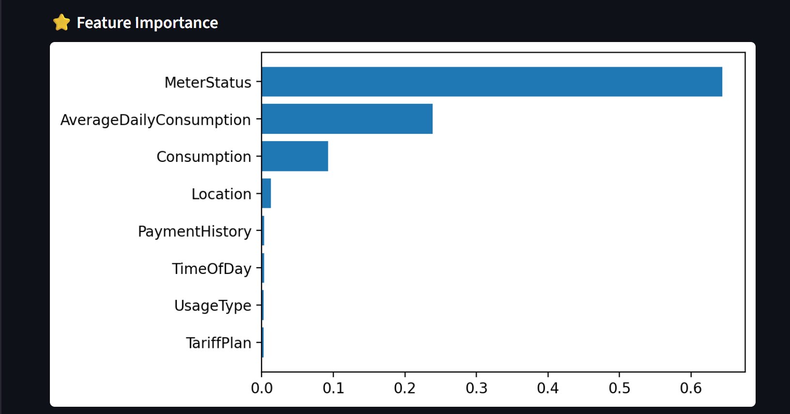
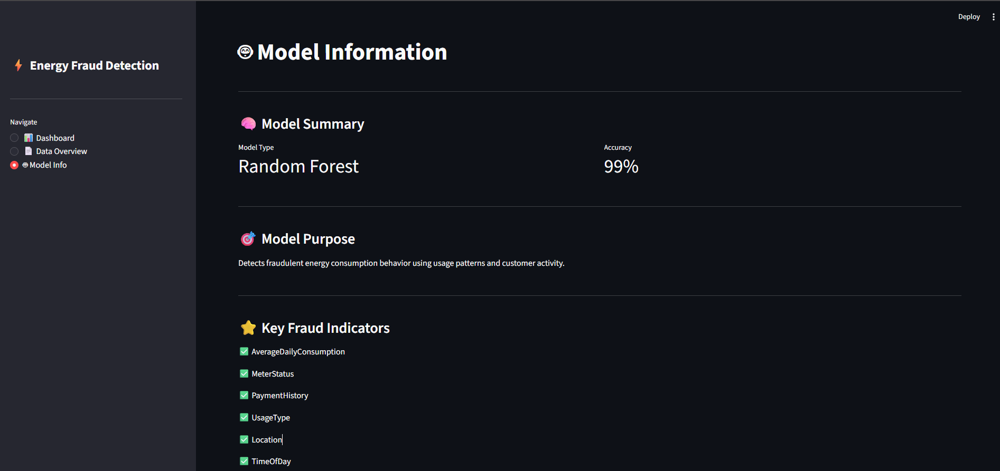
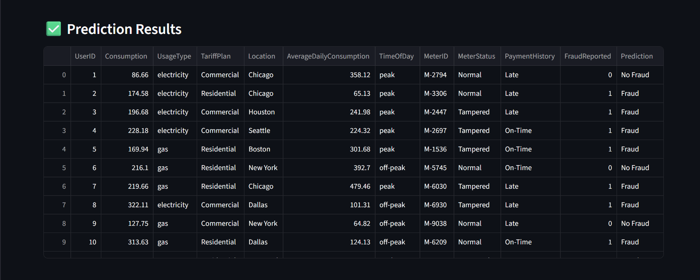

# ⚡ AI-Based Energy Consumption Fraud Detection System

## 📌 Project Overview

This project detects fraudulent electricity and gas consumption using Machine Learning. The system analyzes energy usage patterns and predicts suspicious behavior using a trained classification model.

It helps energy companies identify fraud cases quickly, monitor usage behavior, and generate business insights through an interactive dashboard.

---

## 🚀 Live Demo

👉 **Try the deployed application here:**  
https://vishalrajput74-energy-fraud-detection-m-appstreamlit-app-wcot66.streamlit.app/

Users can:

- Upload dataset
- Download sample dataset
- Detect fraud instantly
- View analytics and insights

---

## 🎯 Problem Statement

Energy companies face financial losses due to fraudulent energy consumption. Manual detection is slow and inefficient.

This project uses Machine Learning to automatically detect fraud based on:

- Energy usage patterns
- Payment history
- Meter status
- Location and consumption behavior

The system provides automated predictions, analytics, and visual insights.

---

## ⭐ Key Features

### 📊 Interactive Dashboard

- Download sample dataset for testing
- Upload CSV dataset
- Fraud prediction using Machine Learning
- Dataset format validation to prevent incorrect uploads
- Business summary KPI metrics
- Fraud percentage calculation
- Professional data visualization

### 📈 Analytics & Visualization

- Fraud vs Non-Fraud distribution (donut chart)
- Top 10 high-risk fraud cases
- Feature importance visualization
- Business insights for decision-making

### 📄 Data Management

- Dataset preview and overview
- Dataset shape and column details
- Download prediction results as CSV

### 🤖 Model Information

- Model details page
- Accuracy information
- Key fraud indicators display

---

## 🧠 Machine Learning Model

- **Model:** Random Forest Classifier
- **Accuracy:** 99%
- **Type:** Classification
- **Purpose:** Detect fraudulent energy consumption behavior
- **Explainability:** Feature importance analysis

---

## 📊 Model Performance

- Model Type: Classification
- Algorithm: Random Forest Classifier
- Accuracy: 99%
- Evaluation Metrics:
  - Precision
  - Recall
  - F1-score
- Feature Importance Analysis performed

---

## 📊 Dataset

- **Source:** Kaggle Energy Consumption Dataset
- Format: CSV
- Contains energy usage patterns, meter readings, payment data, and fraud labels.
- Used for training and testing fraud detection model.

### 📁 Dataset Information

Users can upload their own dataset for prediction.

### ✅ Expected Dataset Format (Required Columns)

The uploaded dataset must contain the following columns:

- Consumption
- UsageType
- TariffPlan
- Location
- AverageDailyConsumption
- TimeOfDay
- MeterStatus
- PaymentHistory

If the format is incorrect, the system will show a validation error.

A sample dataset is provided in the project for testing.

---

## ⚙ Model Training Steps

The machine learning model was developed using the following pipeline:

### Data Preprocessing

- Handling missing values
- Data cleaning
- Feature selection

### Feature Encoding

- Convert categorical variables into numerical format

### Model Training

- Random Forest Classifier training

### Model Evaluation

- Accuracy measurement
- Performance validation

### Model Saving

- Saved using Joblib for deployment

---

## 🛠 Tech Stack

- Python
- Streamlit
- Pandas
- Scikit-learn
- Matplotlib
- Joblib

---

## 📂 Project Structure

```
energy-fraud-detection-ml/
│
├── app/
│   └── streamlit_app.py
│
├── data/
│   ├── energy_fraud_dataset.csv
│   └── sample_energy_data.csv
│
├── models/
│   └── fraud_model.pkl
│
├── notebook/
│   └── fraud_detection.ipynb
│
├── src/
│   └── train_model.py
│
├── assets/
│   ├── dashboard.png
│   ├── business_summary.png
│   ├── fraud_chart.png
│   ├── top_fraud_cases.png
│   ├── feature_importance.png
│   ├── model_summary.png
│   └── prediction_results.png
│
├── requirements.txt
└── README.md
```

---

## 🚀 Installation

### 1️⃣ Clone Repository

```
git clone https://github.com/vishalrajput74/energy-fraud-detection-ml
cd energy-fraud-detection-ml
```

### 2️⃣ Install Dependencies

```
pip install -r requirements.txt
```

---

## ▶ How to Run the Project

### Train the Model (Optional)

```
python src/train_model.py
```

### Run Streamlit Application

```
streamlit run app/streamlit_app.py
```

The application will open automatically in your browser.

---

## 📊 Application Output

The system provides:

- Fraud prediction results
- Business summary dashboard with KPIs
- Fraud distribution visualization
- Top fraud records table
- Feature importance chart
- Dataset overview and statistics
- Model information display
- Downloadable prediction results

---

## 📸 Application Preview

### 📊 Dashboard Interface



### 📈 Fraud Detection Results / Business Summary



### 📊 Fraud Distribution Chart

This chart shows fraud vs non-fraud transactions.  


### 🔴 Top Fraud Cases



### ⭐ Feature Importance



### 🤖 Model Information



### ✅ Prediction Results Table



---

## 🚀 Future Improvements

- Real-time fraud detection system
- Database integration
- REST API deployment
- Deep learning models
- Model monitoring system
- Cloud deployment (AWS/GCP/Azure)

---

## 👨‍💻 Author

**Vishal Rajput**
